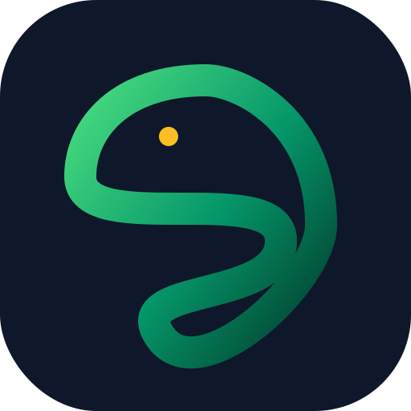

<div align="center">
  
  
  
  
  
  
</div>

<h1 align="center">
  
  巨蛇王国 (The Serpent Kingdom)
</h1>

<div align="center">
  <p><strong>一款基于 React、Vite 和 HTML5 Canvas 构建的史诗级 Roguelite 生存游戏。</strong></p>
  <p>
    <a href="README.md">English</a>
    ·
    <a href="README.zh-CN.md">简体中文</a>
    ·
    <a href="#-快速开始">快速开始</a>
    ·
    <a href="#-参与贡献">参与贡献</a>
  </p>
</div>

<div align="center">
  <i>"夺回王座。吞噬灵魂。飞升化龙。"</i>
</div>

---

## 📖 简介

**《巨蛇王国》 (The Serpent Kingdom)** 是一款基于浏览器的动作类 Roguelite 游戏，灵感来源于经典的贪吃蛇机制，并将其提升到了现代生存动作游戏的标准。你将扮演远古深渊巨蛇，在危险重重的境界中穿梭，吞噬发光的灵魂以成长，解锁神秘的法术能力，并击败维度首领来夺回你失去的王座！

我们已将此项目开源，以允许社区添加新的生物群落、敌人和技能！

## 📸 游戏截图

<details open>
<summary><b>点击展开/折叠游戏截图</b></summary>
<br/>

| **营地大厅 (Progression UI)** | **激烈的首领战** | **深度的技能树** |
| :---: | :---: | :---: |
|  |  |  |

*(注：截图仅展示 UI 界面。请在本地运行项目以体验极其流畅的 60 帧粒子特效与动画！)*
</details>

---

## ✨ 核心特色与游戏系统

### 🎮 动感十足的动作玩法
- **极致流畅的引擎:** 高度优化的 2D Canvas 渲染引擎，在同屏包含数百个实体、粒子和弹幕的情况下依然保持 60+ FPS 运行。
- **响应式控制:** 随时随地畅玩。支持桌面端（WASD、方向键、鼠标跟随）和移动端（虚拟摇杆、任意位置触控）。
- **战术性战斗:** 用头部咬击敌人，或者用你长长的尾巴将它们紧紧缠绕以发动毁灭性的“鞭击”！

### 🐉 深入的 Roguelite 成长系统
- **局内技能树:** 在单局游戏中解锁强大的主动技能，包括 *毒牙 (Fang Poison)*、*石肤 (Body Armor)*、*电火花 (Spark Magic)*、*时光位移 (Chrono Shift)*、*血之盛宴 (Blood Feast)*、*虚空磁场 (Void Magnet)*、*诸神黄昏 (Ragnarok)*，以及*终极风暴 (Serpent Tempest)*。
- **永久天赋:** 消耗金币获得永久的被动属性提升（*最大生命值*、*移动速度*、*磁吸范围*、*灵魂倍率*），让每次开局都更加强大。
- **遗物与神器:** 使用从宝库中找到的物品来自定义你的构筑 (Build)，如 *沙漏 (Hourglass)*、*灵魂瓮 (Soul Urn)*、*贪婪王冠 (Crown of Greed)*、*凤凰灰烬 (Phoenix Ash)* 和 *吸血鬼头骨 (Vampiric Skull)*。
- **巨蛇形态 (皮肤):** 改变外观并获得独特的元素增益。可解锁的形态包括 *黑曜石君主 (Sovereign Obsidian)*、*翡翠蛇怪 (Jade Basilisk)*、*猩红恐惧 (Crimson Dread)*，以及 *暗影九头蛇 (Shadow Hydra)*。

### 👹 史诗级内容
- **首领战:** 在不断升级的敌人波数中生存下来，直到得分达到巅峰，面对拥有独特弹幕攻击模式的强大守卫首领。
- **多样的生物群落:** 探索各具特色的唯美环境：*深渊 (The Abyss)*、*闹鬼森林 (Haunted Forest)*、*冰冻王国 (Frozen Kingdom)* 以及 *火山遗迹 (Volcanic Ruins)*。
- **成就与任务:** 完成每日任务和终身成就，赢取金币、灵魂和稀有水晶。解锁如 *灵魂收割者 (Soul Reaper)* 和 *异星半神 (Eldritch Demigod)* 这样的动态头衔。

### 🎓 沉浸式新手引导
- **UI 导览:** 电影般的交互式界面导览，为新玩家解释所有营地成长系统。
- **实战教程:** 循序渐进的交互式实战，教你移动、战斗、使用技能和对抗首领的诀窍。

---

## 🛠️ 技术栈

本项目利用现代 Web 技术在浏览器中提供高性能的游戏体验：

- **框架**: [React 18](https://react.dev/)
- **构建工具**: [Vite](https://vitejs.dev/)
- **样式**: [Tailwind CSS v3](https://tailwindcss.com/)
- **游戏引擎**: 自定义 HTML5 `<canvas>` 渲染循环 (零外部游戏引擎依赖)
- **状态管理**: React Hooks + Context + 游戏存档持久化 LocalStorage
- **图标**: [Google Material Symbols](https://fonts.google.com/icons)
- **部署**: 专为标准静态托管平台优化 (Vercel, Netlify, Cloud Run, GitHub Pages)

---

## 🚀 快速开始

### 环境要求

请确保您的电脑上已安装 [Node.js](https://nodejs.org/) (v18 或更高版本) 以及 `npm`。

### 安装步骤

1. **克隆仓库**
   ```bash
   git clone https://github.com/yourusername/serpent-kingdom.git
   cd serpent-kingdom
   ```

2. **安装依赖**
   ```bash
   npm install
   ```

3. **启动开发服务器**
   ```bash
   npm run dev
   ```
   游戏将在 `http://localhost:3000` 运行。

### 生产环境构建

构建用于生产环境的压缩版静态文件：

```bash
npm run build
```
编译后的静态文件将生成在 `dist` 目录中，可直接通过任何静态 Web 服务器托管。

---

## 📁 项目结构

```text
serpent-kingdom/
├── src/
│   ├── components/      # React 组件 (UI 面板、模态框、游戏画布)
│   │   ├── GameCanvas.tsx       # 核心游戏引擎与渲染循环
│   │   ├── MainDashboard.tsx    # 局外成长与营地主界面
│   │   ├── UITourOverlay.tsx    # 交互式新手导览
│   │   └── ...
│   ├── lib/             # 工具函数与管理器
│   │   ├── audio.ts             # 音效与背景音乐管理器
│   │   └── ...
│   ├── App.tsx          # 应用程序主入口及状态路由
│   ├── index.css        # Tailwind CSS 引入及全局样式
│   ├── main.tsx         # React DOM 渲染入口
│   └── types.ts         # TypeScript 接口及游戏核心数据定义
├── public/              # 静态资源 (图片、音效文件、网站图标)
├── package.json         # 依赖及脚本命令
├── vite.config.ts       # Vite 构建配置
└── tailwind.config.js   # Tailwind 主题定义
```

---

## 🕹️ 怎么玩

1. **移动**: 使用 `W`、`A`、`S`、`D`、`方向键` 或移动 `鼠标` 来控制方向。在移动设备上，请在屏幕任意位置触摸并拖动以使用虚拟摇杆。
2. **收集灵魂**: 吞噬敌人掉落的发光灵魂来延长你的尾巴，并赚取分数和金币。
    - 🟢 *绿色*: 普通 (分数/金币)
    - 🟡 *金色*: 稀有 (大量金币)
    - 🔴 *红色*: 诅咒 (额外经验值 XP)
3. **躲避攻击**: 躲避敌人的弹幕。你的头部非常脆弱，但你的身体可以承受攻击！
4. **战斗**: 咬击普通敌人，或者用身体缠绕他们将其粉碎。这能让领域首领更快出现。
5. **生存与飞升**: 使用你解锁的技能，击败领域首领，并带着你的战利品凯旋，在营地中强化你的巨蛇！

---

## 🤝 参与贡献

我们非常欢迎来自开源社区的贡献！无论您是修复 Bug、添加新的生物群落、设计新的首领，还是改进文档，我们都感激不尽。

### 贡献指南

1. 在 GitHub 上 **Fork 本仓库**。
2. **克隆你的 Fork 版本** 到本地。
3. **创建新分支** 用于开发新功能或修复 Bug (`git checkout -b feature/amazing-new-boss`)。
4. **提交你的更改** 并进行彻底测试。
5. **撰写描述性的 Commit 信息** (`git commit -m 'Add amazing new Volcanic Boss'`)。
6. **推送到你的分支** (`git push origin feature/amazing-new-boss`)。
7. 提交一个指向本仓库 `main` 分支的 **Pull Request**。

### 开发注意事项
- 请遵循现有的代码风格 (React 函数式组件、Tailwind 样式)。
- 在添加新的游戏实体 (敌人、强化道具) 时，请更新 `src/types.ts`，并确保 `GameCanvas.tsx` 中的渲染逻辑能够高效处理它们。

---

## 🗺️ 开发路线图 (Roadmap)

- [ ] **多人排行榜:** 接入后端服务 (如 Firebase) 以支持全球高分榜。
- [ ] **手柄支持:** 添加 Gamepad API 支持，以允许使用主机手柄游玩。
- [ ] **全新生物群落:** 添加 *天界 (The Celestial Realm)* 和 *沉没之城 (The Sunken City)*。
- [ ] **模组 (Mod) API:** 暴露 Hooks，让社区能够轻松添加自定义的巨蛇形态。

---

## 📄 许可证

本项目开源并基于 [MIT 许可证](LICENSE) - 详情请查看 LICENSE 文件。你可以自由地使用、修改和分发本软件。

---

## 🙏 致谢

- 灵感来源于经典的贪吃蛇以及现代 Roguelite 生存类游戏。
- 图标由 [Google Material Symbols](https://fonts.google.com/icons) 提供。
- UI 设计灵感来源于诸多优秀的移动端及网页端游戏大作。

<div align="center">
  <p>由巨蛇王国团队用 ❤️ 制作</p>
</div>
